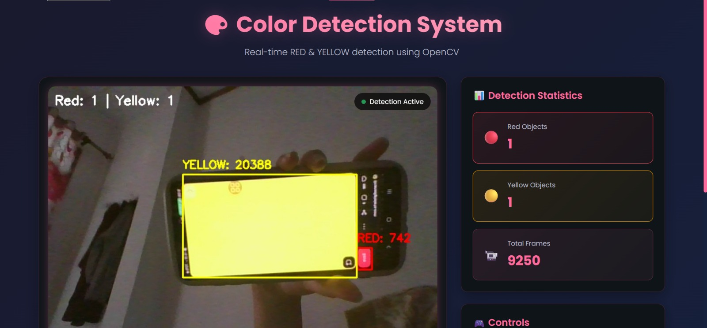

# Color Detection System - RED & YELLOW

A real-time color detection system using OpenCV that detects red and yellow objects through webcam input with a pink dark-themed web interface.

## Screenshot



## Features

- Real-time Detection: Live webcam feed with instant color detection
- Dual Color Support: Simultaneous detection of RED and YELLOW objects
- Modern UI: Pink dark-themed web interface
- Live Statistics: Real-time counting of detected objects
- Interactive Controls: Toggle detection and refresh statistics
- Responsive Design: Works on desktop and mobile devices
- High Performance: Optimized OpenCV processing with morphological operations

## Technology Stack

- Python 3.7+
- OpenCV (cv2)
- Flask
- NumPy
- HTML/CSS/JavaScript

## Requirements

- Python 3.7 or above
- Webcam/Camera device
- Modern web browser

## Installation

```bash
git clone https://github.com/milo0w/ColorDetection.git
cd ColorDetection - Nasywa Kamila
python -m venv venv
source venv/bin/activate  # On Windows: venv\Scripts\activate
pip install -r requirements.txt
```

## How to Run

### Method 1: Web Interface
```bash
python app.py
```
Open browser and go to `http://localhost:5000`

### Method 2: Standalone Script
```bash
python color_detection.py
```

Keyboard Controls:
- `q` Quit
- `r` Toggle red color detection
- `y` Toggle yellow color detection

## How It Works

### Color Space Conversion
Frames are converted from RGB to HSV color space for more robust detection.

### Color Range Definition
```python
color_ranges = {
    'red': [
        {'lower': np.array([0, 50, 50]), 'upper': np.array([10, 255, 255])},
        {'lower': np.array([170, 50, 50]), 'upper': np.array([180, 255, 255])}
    ],
    'yellow': [
        {'lower': np.array([20, 100, 100]), 'upper': np.array([30, 255, 255])}
    ]
}
```

### Mask Creation and Noise Reduction
Binary masks are created for each color range and morphological operations are applied to reduce noise.

### Object Detection and Visualization
Contours are found, bounding rectangles are drawn, counts and areas displayed, and real-time statistics updated.

### Web Streaming
Flask serves the processed video stream, JavaScript updates statistics and handles user interactions.

## Project Structure

```
ColorDetection/
├── README.md
├── requirements.txt
├── app.py
├── color_detection.py
├── templates/
│   └── index.html
├── static/
│   ├── css/
│   │   └── style.css
│   ├── js/
│   │   └── main.js
│   └── assets/
│       └── demo.jpg
└── .gitignore
```

## Configuration

### Adjusting Color Ranges
Modify HSV ranges in `color_detection.py` as needed.

### Minimum Object Size
Change the `min_area` parameter in `draw_detections` for larger or smaller objects.

## Usage Tips

- Ensure good lighting conditions
- Use reasonably sized objects
- Use pure red and yellow colors
- Avoid backgrounds with similar colors
- Keep the camera stable

## Troubleshooting

**Camera not opening**: Check if it is used by another application or change the camera index.  
**Colors not detected properly**: Adjust HSV ranges, lower the minimum area threshold, or use purer colors.  
**Slow processing**: Reduce frame resolution, increase minimum area threshold, or close other applications using the camera.

## Contributing

1. Fork the repository
2. Create your feature branch
3. Commit your changes
4. Push to the branch
5. Open a Pull Request

## License

This project is licensed under the MIT License - see the LICENSE file for details.

## Support

Check the troubleshooting section, open an issue on GitHub, or contact the maintainer.
>>>>>>> 7621cf5 (Initial commit)
